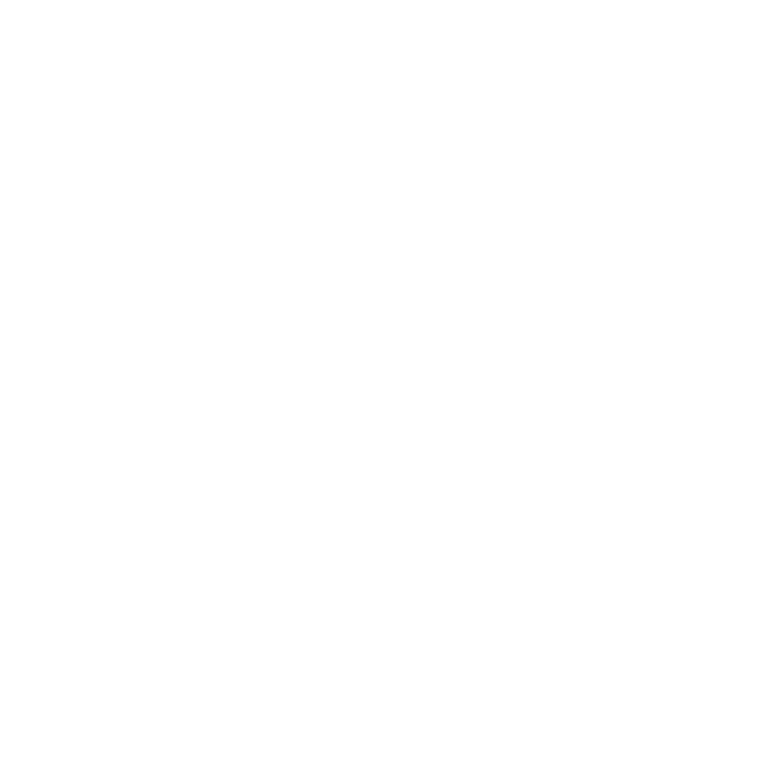

# Slate 

An infinite canvas application for creating and organizing rich content nodes with support for text, images, videos, and PDFs.



## Features

- 🎨 **Infinite Canvas**: A boundless space for your content with smooth pan and zoom
- 📝 **Rich Text Editing**: Full Markdown support with real-time preview
- 🖼️ **Media Support**: Upload and view images, videos, and PDFs
- 🔍 **Smart Search**: Find nodes quickly with content-aware search and filters
- 🎯 **Node Navigation**: Minimap and node finder for easy navigation
- 🌓 **Dark Mode**: Full support for light and dark themes
- 🔄 **Auto-save**: Automatic content saving with visual feedback
- ⌨️ **Keyboard Shortcuts**: Efficient keyboard-based navigation and editing
- 📱 **Responsive Design**: Works on desktop and mobile devices

## Tech Stack

- React + TypeScript
- Tailwind CSS for styling
- Supabase for backend and storage
- Vite for development and building

## Getting Started

1. Clone the repository:
```bash
git clone https://github.com/yourusername/slate-pad.git
cd slate-pad
```

2. Install dependencies:
```bash
npm install
# or
bun install
```

3. Set up environment variables:
Create a `.env` file in the root directory with:
```env
VITE_SUPABASE_URL=your_supabase_url
VITE_SUPABASE_ANON_KEY=your_supabase_anon_key
```

4. Start the development server:
```bash
npm run dev
# or
bun dev
```

5. Visit `http://localhost:8080` in your browser

## Deployment

The project is configured for easy deployment to platforms like Vercel, Netlify, or GitHub Pages. For production builds:

```bash
npm run build
# or
bun run build
```

## Contributing

We welcome contributions! Please see our [Contributing Guidelines](CONTRIBUTING.md) for details on how to submit pull requests, report issues, and contribute to the project.

## Contributors

Thanks to all our contributors who help make Slate Pad better! 

<!-- ALL-CONTRIBUTORS-LIST:START - Do not remove or modify this section -->
<!-- prettier-ignore-start -->
<!-- markdownlint-disable -->
<table>
  <tbody>
    <tr>
      <td align="center" valign="top" width="14.28%"><a href="https://github.com/yourusername"><br /><sub><b>Your Name</b></sub></a><br /><a href="#code-yourusername" title="Code">💻</a></td>
    </tr>
  </tbody>
</table>

<!-- markdownlint-restore -->
<!-- prettier-ignore-end -->

<!-- ALL-CONTRIBUTORS-BADGE:START - Do not remove or modify this section -->
[](#contributors)
<!-- ALL-CONTRIBUTORS-BADGE:END -->

<!-- ALL-CONTRIBUTORS-LIST:END -->

### How to Become a Contributor

1. Fork the repository
2. Create a new branch for your feature
3. Make your changes
4. Submit a pull request
5. Get reviewed and merged

See our [Contributing Guidelines](CONTRIBUTING.md) for detailed information.

## License

This project is open source and available under the [MIT License](LICENSE).

## Support

If you encounter any issues or have questions:
1. Check the [Issues](https://github.com/yourusername/slate-pad/issues) page
2. Create a new issue if your problem isn't already listed
3. Join our community discussions

## Star the Project ⭐

If you find Slate useful, please consider giving it a star! It helps us grow and improve the project.
